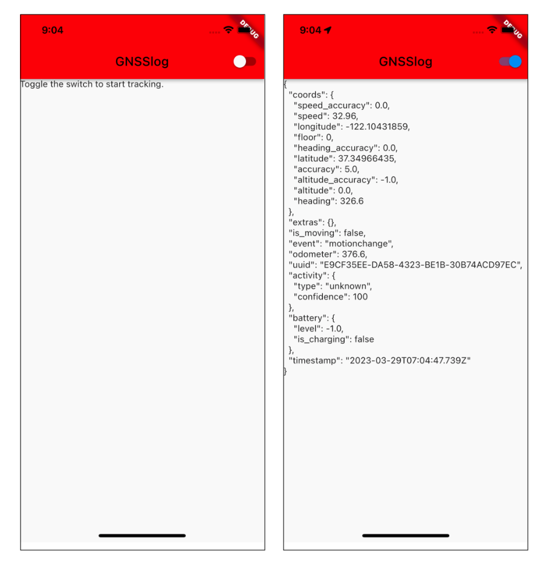
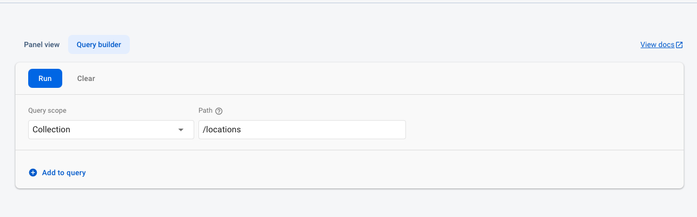
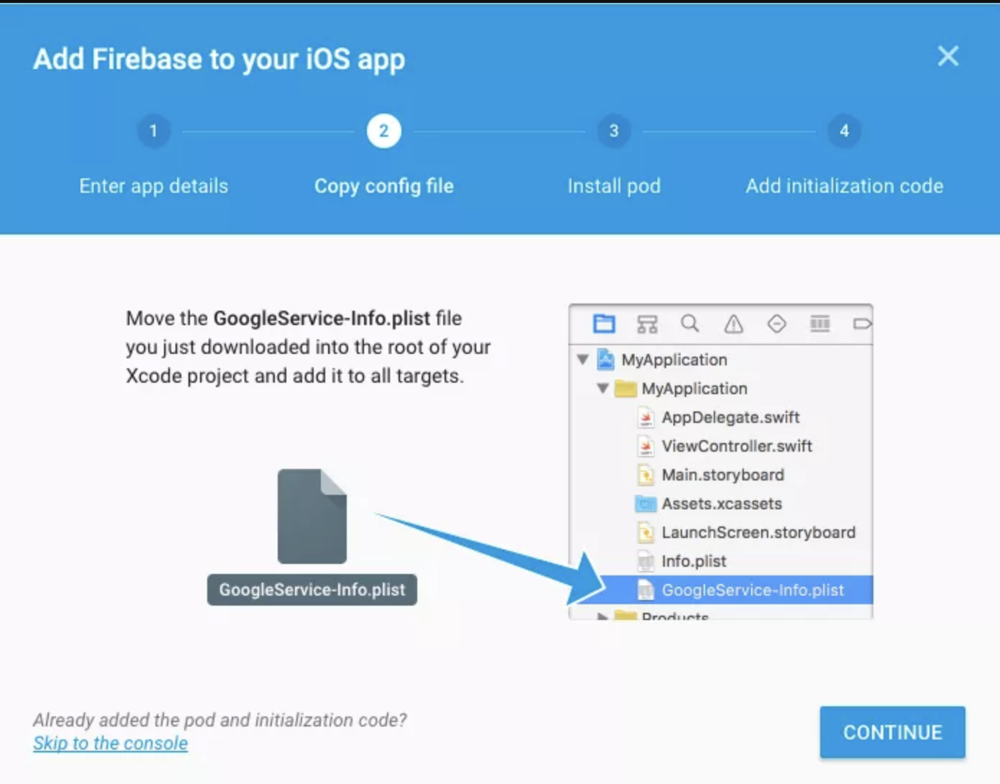

# GNSSlog

GNSSlog:  IOS App for GPS Data Logging on Firestore with Flutter.



## Installing the Plugins

open_file_folder: **`pubspec.yaml`**:

```yaml
dependencies:
  background_geolocation_firebase: '^1.0.0'
  flutter_background_geolocation: ^4.6.2
  cupertino_icons: ^1.0.2
```

## Create a Firestore DB:

### - Follow [the documentation](https://firebase.google.com/docs/firestore/quickstart) to create a new Firestore project.

### - Add this rules to your database:

```
// Allow read/write access to all users under any conditions
// Warning: **NEVER** use this rule set in production; it allows
// anyone to overwrite your entire database.
rules_version = '2';
service cloud.firestore {
  match /databases/{database}/documents {
    match /{document=**} {
      allow write: if true;
    }
  }
}
```

In **Query builder** I selected "Collections" as scope and then as path "/locations".



In fact in my code the configuration parameters for "BackgroundGeolocationFirebase" are:

```
BackgroundGeolocationFirebase.configure(BackgroundGeolocationFirebaseConfig(
      locationsCollection: "locations",
      updateSingleDocument: false
    ));
```

## Google-Services-Info.plist

From your Firebase Console, copy your downloaded **Google-Services-Info.plist** file into your application (**I deleted mine to avoid confusion!!**):



## Default data structure:

`BackgroundGeolocation` will post its [default "Location Data Schema"](https://github.com/transistorsoft/flutter_background_geolocation/wiki/Location-Data-Schema) to your Firebase app.

```json
{
    "location": {
        "coords": {
            "latitude":   [Float],
            "longitude":  [Float],
            "accuracy":   [Float],
            "speed":      [Float],
            "heading":    [Float],
            "altitude":   [Float]
        },
        "extras": {   // <-- optional extras.  @see #getCurrentPosition for details
            "foo": "bar"
        },
        "activity": {
            "type": [still|on_foot|walking|running|in_vehicle|on_bicycle|unknown],
            "confidence": [0-100%]
        },
        "geofence": {  // <-- Present only if a geofence was triggered at this location
            "identifier": [String],
            "action": [String ENTER|EXIT]            
        },
        "battery": {
            "level": [Float],
            "is_charging": [Boolean]
        },
        "timestamp": [ISO-8601 UTC], // eg:  "2015-05-05T04:31:54.123Z"
        "uuid":      [String],       // <-- Universally unique identifier
        "event"      [String],       // <-- motionchange|geofence|heartbeat
        "is_moving": [Boolean],      // <-- The motion-state when location was recorded (@deprecated; use #event)
        "is_heartbeat: [Boolean],    // <-- If this location was recorded during heartbeat mode.
        "odometer": [Float/meters]
    }
}
```

I used then this as the general data schema to build the DB structure. I was able to import the data direclty in my Firestore DB without any function implementation.

Anyway From the documentation you should implement (**AS I SAID DID NOT DO IT**) your own [Firebase Functions](https://firebase.google.com/docs/functions) to manipulate the incoming data in your collection as desired. For example:

```typescript
import * as functions from 'firebase-functions';

exports.createLocation = functions.firestore
  .document('locations/{locationId}')
  .onCreate((snap, context) => {
    const record = snap.data();

    const location = record.location;

    console.log('[data] - ', record);

    return snap.ref.set({
      uuid: location.uuid,
      timestamp: location.timestamp,
      is_moving: location.is_moving,
      latitude: location.coords.latitude,
      longitude: location.coords.longitude,
      speed: location.coords.speed,
      heading: location.coords.heading,
      altitude: location.coords.altitude,
      event: location.event,
      battery_is_charging: location.battery.is_charging,
      battery_level: location.battery.level,
      activity_type: location.activity.type,
      activity_confidence: location.activity.confidence,
      extras: location.extras
    });
});


exports.createGeofence = functions.firestore
  .document('geofences/{geofenceId}')
  .onCreate((snap, context) => {
    const record = snap.data();

    const location = record.location;

    console.log('[data] - ', record);

    return snap.ref.set({
      uuid: location.uuid,
      identifier: location.geofence.identifier,
      action: location.geofence.action,
      timestamp: location.timestamp,
      latitude: location.coords.latitude,
      longitude: location.coords.longitude,
      extras: location.extras,
    });
});

```

### Configuration Options

#### `@param {String} locationsCollection [locations]`

The collection name to post `location` events to.  Eg:

```javascript
BackgroundGeolocationFirebase.configure(BackgroundGeolocationFirebaseConfig(
  locationsCollection: '/locations'
));

BackgroundGeolocationFirebase.configure(BackgroundGeolocationFirebaseConfig(
  locationsCollection: '/users/123/locations'
));

BackgroundGeolocationFirebase.configure(BackgroundGeolocationFirebaseConfig(
  locationsCollection: '/users/123/routes/456/locations'
));

```

#### `@param {String} geofencesCollection [geofences]`

The collection name to post `geofence` events to.  Eg:

```javascript
BackgroundGeolocationFirebase.configure(BackgroundGeolocationFirebaseConfig(
  geofencesCollection: '/geofences'
));

BackgroundGeolocationFirebase.configure(BackgroundGeolocationFirebaseConfig(
  locationsCollection: '/users/123/geofences'
));

BackgroundGeolocationFirebase.configure(BackgroundGeolocationFirebaseConfig(
  locationsCollection: '/users/123/routes/456/geofences'
));

```


#### `@param {Boolean} updateSingleDocument [false]`

If you prefer, you can instruct the plugin to update a *single document* in Firebase rather than creating a new document for *each* `location` / `geofence`.  In this case, you would presumably implement a *Firebase Function* to deal with updates upon this single document and store the location in some other collection as desired.  If this is your use-case, you'll also need to ensure you configure your `locationsCollection` / `geofencesCollection` accordingly with an even number of "parts", taking the form `/collection_name/document_id`, eg:

```javascript
BackgroundGeolocationFirebase.configure(BackgroundGeolocationFirebaseConfig(
  locationsCollection: '/locations/latest'  // <-- 2 "parts":  even
));

// or
BackgroundGeolocationFirebase.configure(BackgroundGeolocationFirebaseConfig(
  locationsCollection: '/users/123/routes/456/the_location'  // <-- 4 "parts":  even
));

// Don't use an odd number of "parts"
BackgroundGeolocationFirebase.configure(BackgroundGeolocationFirebaseConfig(
  locationsCollection: '/users/123/latest_location'  // <-- 3 "parts": odd!!  No!
));

```